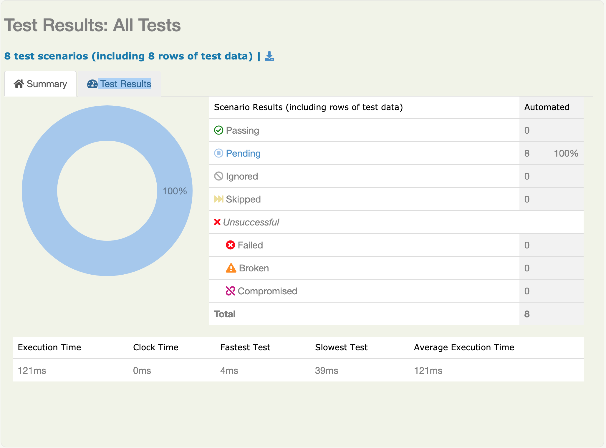

>Note: use _mvn clean verify_ for subsequ folder# Authentication Services
This documentation is part of this blog [post]().

## Prerequisites
Install the following software in your development environment:
1. Java JDK
2. Maven
3. Git (Optional)

This example uses JBehave and Java, and the project is built using Maven.

### Password Validator Kata
This example is based on the [Password Validator Kata](https://github.com/donaldsiziba/password-validator) blog. Go ahead and clone or simply download the project from Github.  
```bash
git clone https://github.com/donaldsiziba/password-validator
```
After getting the project on your local environment, go ahead and build the project by executing the command below in projects root directory:
```bash
mvn install
```
>Note: use _mvn clean verify_ for subsequ
## The Project Structure
```
└── src
    ├── main
    │   ├── java
    │   │   └── za
    │   │       └── co
    │   │           └── awesomatic
    │   └── resources
    └── test
        ├── java
        │   └── za
        │       └── co
        │           └── awesomatic
        │               └── authentication
        │                   └── AuthenticationApplicationTestSuite.java             # Acceptance Test Runner                                                                
        └── resources
            └── stories                                                             # Story files folder
                └── ValidatePassword.story              
```
## Acceptance Tests
To run the _Acceptance Test Suite_, type the following in command line on the project's root directory:
```bash
mvn verify
```
>Note: use _mvn clean verify_ for subsequent builds.
### Acceptance Test Reports
After the build has run, the Acceptance Test reports can be found in _target/site/serenity_. Use a browser to view the _index.html_ file.

### Test Results Page
The test results below indicates that all test scenarios are still pending as no code has been implemented yet.
